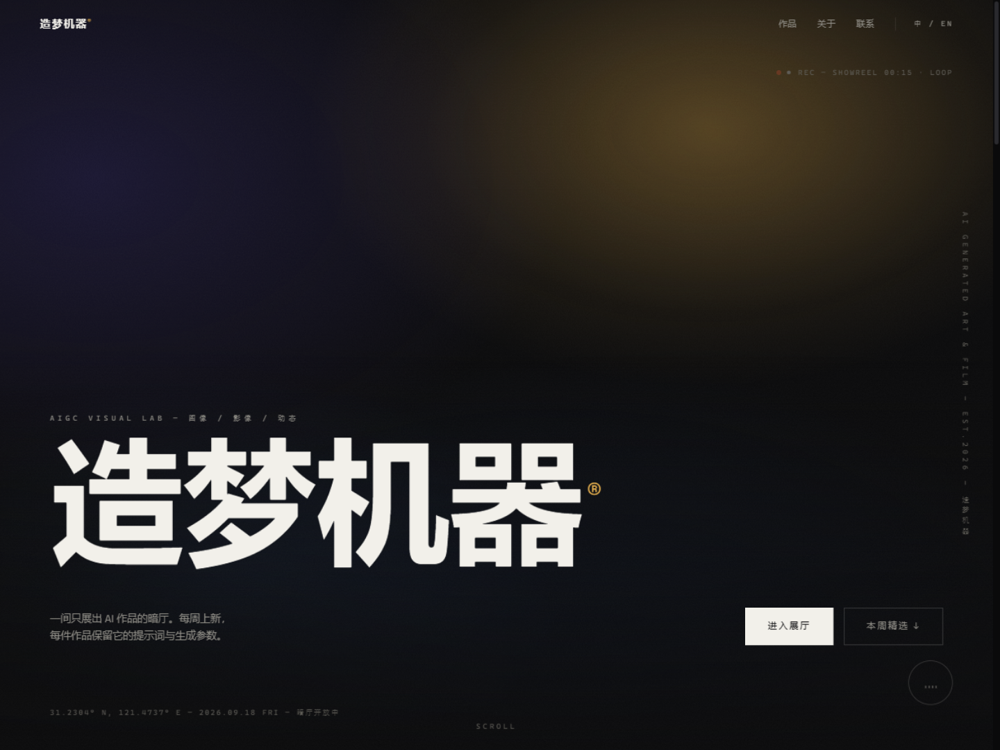
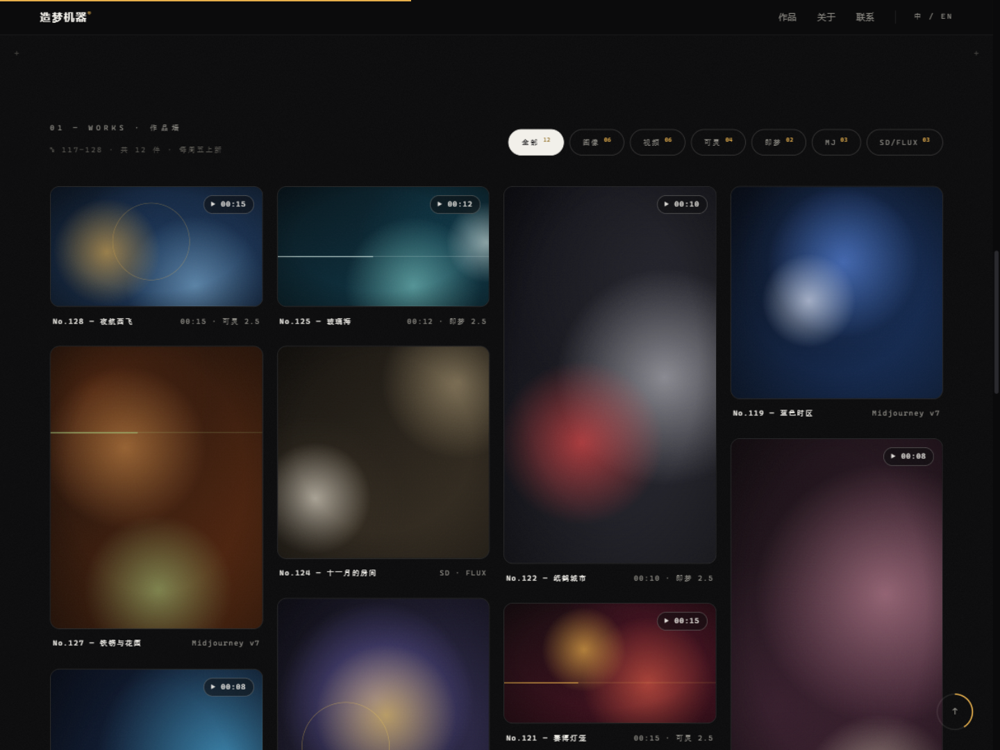
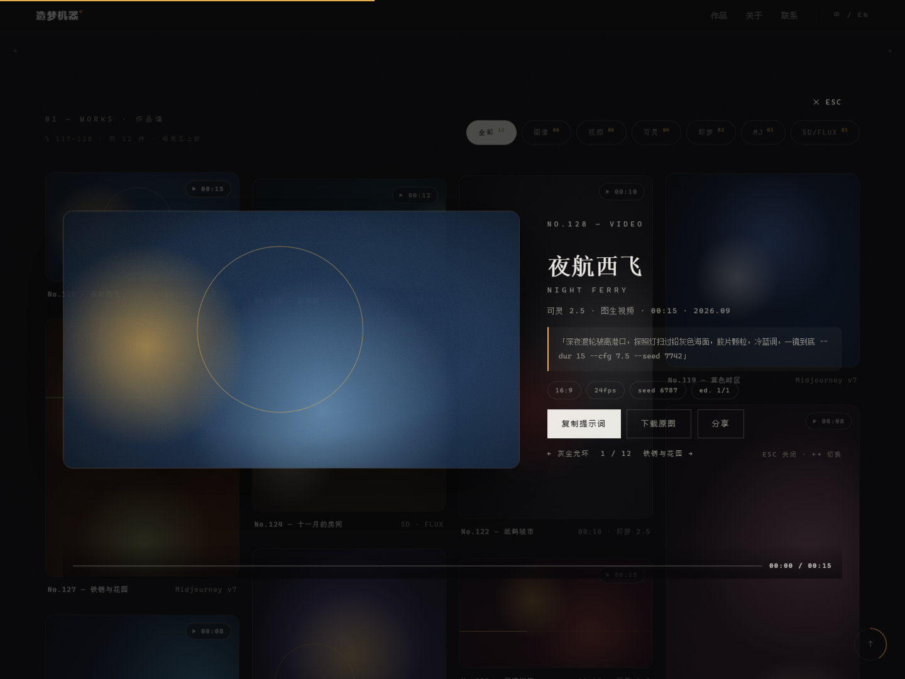
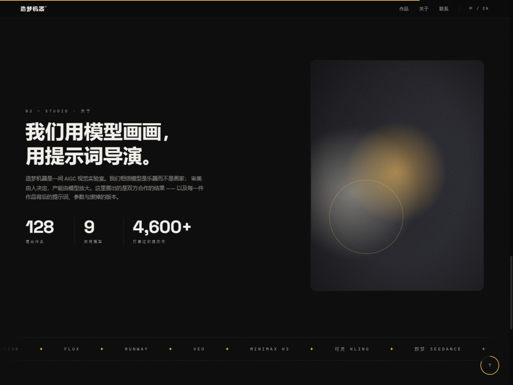
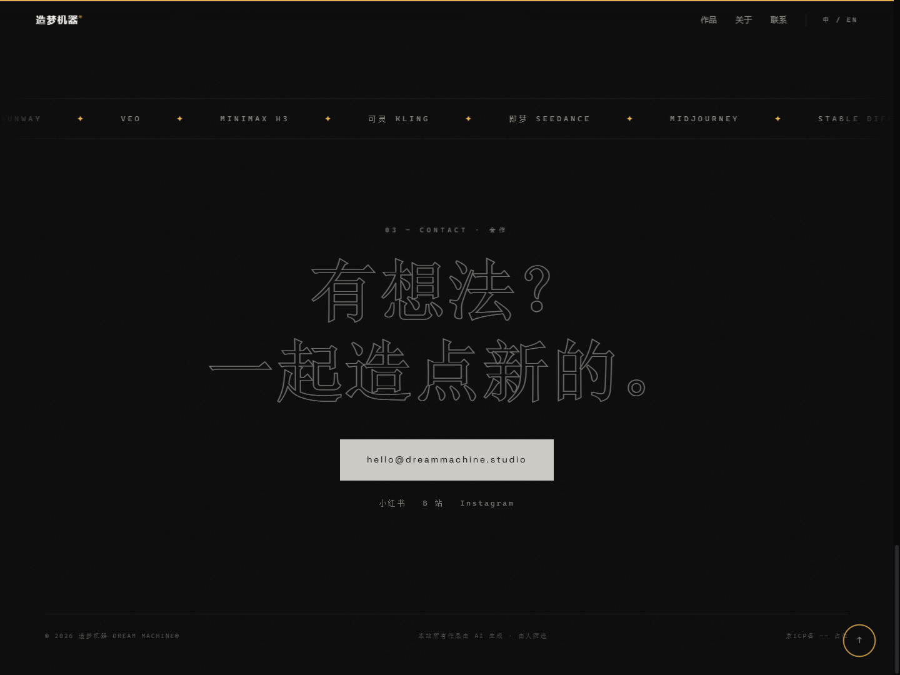

<div align="center">

# 造梦机器® — DREAM MACHINE GALLERY

**一间只展出 AI 生成作品的线上暗厅画廊 · A dark gallery for AI-generated art & film**

[](LICENSE)
[](https://vitejs.dev/)
[](https://www.typescript.org/)
[](package.json)

图像 · 影像 · 动态 —— 每件作品保留完整的提示词与生成参数。

</div>

---

## ✨ 预览

| 首屏 · 全屏光晕 + 压屏大字 |
| :---: |
|  |

| 作品墙（图像/视频混排瀑布流） | 详情灯箱（提示词 + 参数） |
| :---: | :---: |
|  |  |

| 关于 · 数据统计 | 联系 · 描边字 |
| :---: | :---: |
|  |  |

## ✨ 特性

**视觉与排版**
- 暗厅气质（`#0a0a0b`）+ 单一钨丝灯强调色（`#e8b04b`），全站胶片颗粒纹理
- 13vw 级压屏大字、衬线中英双语标题、等宽字标签系统、超大描边编号
- 多层径向光晕首屏（无接缝）、竖排侧字、坐标铭牌（实时日期）

**动效**
- 开场幕帘计数器 → 首屏文字逐行显影
- 滚动显影（上移淡入）、统计数字 count-up、滚动进度线、回顶进度环
- 视频卡 hover 播放态（光斑漂移 + 播放钮 + 扫光）、卡片 3D 微倾斜
- 双层自定义光标（悬停作品变 `OPEN` / `PLAY` 标签）、磁性按钮
- 双 marquee（边缘渐隐遮罩、hover 减速）
- 滚轮阻尼平滑滚动（Lenis 风格 duration 缓动：输入 ×0.92 减速、1.15s easeOutExpo 到位，无惯性尾；锚点 / 键盘 / 滚动条滚动自动同步，灯箱内不接管）

**功能**
- 作品筛选：按类型 / 模型，带形变过渡与数量上标
- 详情灯箱：键盘 `←` `→` 切换、`ESC` 关闭、`#w128` 哈希直链分享
- 全键盘可达：作品卡 `Tab` 聚焦、`Enter` 打开灯箱；灯箱内焦点圈禁、关闭归还焦点
- **一键复制提示词**（含参数，写入剪贴板 + toast，失败有明确提示）
- 分享按钮：移动端调系统分享面板，桌面复制深链
- 视频作品假播放进度条 + 时码；真实视频素材进视口才播放、离开暂停；响应式 4 / 3 / 2 / 1 列瀑布流
- `prefers-reduced-motion` 降级、键盘 `focus-visible` 可达性

## 🚀 快速开始

```bash
git clone https://github.com/sheengoa/dream-machine-gallery.git
cd dream-machine-gallery
npm install
npm run dev        # 开发模式 → http://localhost:5173
```

```bash
npm run build      # 构建到 dist/（JS ≈ 7KB gzip）
npm run preview    # 本地预览构建产物
```

> `dist/` 为纯静态文件，可部署到 GitHub Pages / Vercel / Netlify / 任意静态托管（已设 `base: './'`，支持子路径）。

### 服务器部署（shiqing.cc）

```bash
./deploy.sh          # 构建 + 同步 dist/ 到服务器 + 线上验证
./deploy.sh --full   # 额外同步仓库源码（不含 node_modules / .git）
```

服务器：nginx 静态站点（`sites-available/dream-machine-gallery`），80 自动跳转 443，证书由 certbot 自动续期。服务器与端口在脚本头部变量中配置。

## 🖼 添加你的作品

编辑 `src/data/works.ts`，为作品补充 `media` 字段，渲染层会自动用真实素材替换程序化占位视觉：

```ts
{
  id: 128, title: "夜航西飞", en: "NIGHT FERRY",
  model: "可灵 2.5", type: "video", ratio: "16:9",
  dur: "00:15", year: "2026.09", seed: 11,
  pal: ["#0b1626", "#1d3a5f", "#8fc3e8"], accent: "#e8b04b", geo: "ring",
  prompt: "深夜渡轮驶离港口，探照灯扫过铅灰色海面……",
  media: { kind: "video", src: "/works/128.mp4", poster: "/works/128.jpg" },  // ← 加这一行
}
```

- 素材放入 `public/works/`，视频建议 ≤ 8MB 并配置 poster 封面
- 不加 `media` 字段时，将使用按 `seed` 生成的程序化渐变视觉（所见即占位）

## 📁 项目结构

```
├── index.html               页面骨架
├── vite.config.ts           base:'./' · 端口 · es2022
├── public/favicon.svg
└── src/
    ├── main.ts              全部交互逻辑
    ├── styles/main.css      视觉层（设计令牌集中在 :root）
    ├── data/works.ts        作品数据（类型化）
    └── modules/art.ts       程序化占位视觉 / 真实素材渲染
```

## 🎨 定制

设计令牌集中在 `src/styles/main.css` 的 `:root`：底色、强调色、字体栈、缓动曲线均可一处调整。
作品墙的瀑布流列数、光斑配色、颗粒强度等同样即改即得。

## ⚡ 性能

- 运行时零依赖，字体自托管（@fontsource/space-grotesk），全站无任何第三方请求；构建产物 JS ≈ 7KB（gzip）
- 滚动驱动效果全部走 `requestAnimationFrame` + 被动监听
- 大颗粒滤镜仅用于大图位，卡片交给全局颗粒层，避免 12 个 `feTurbulence` 叠加
- 图片 `loading="lazy"`、`content` 显影由 `IntersectionObserver` 驱动

## 📄 License

[MIT](LICENSE) © 2026 sheengoa
